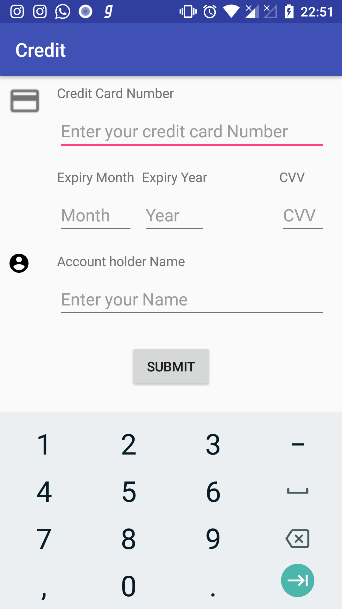

# Credit

* An Android application that obtains credit/debit card details from a user and submits the data to an API .
* Form validations are added to prevent wrong inputs to be sent to server.
* Upon success it prints the request code with success message or the error message.

# Specials

* Validations are handled from the view itself
* Scoping is done for better module management

# Technical Info

* Written purely in Kotlin.
* Built on MVVC architecture to facilitate separation of business logic.
* Using the latest libraries like Architecture Components & Dagger for speedy caching and Dependency Injection.
* Espresso for testing the validation logic.
* Abstraction layers & Repository patterns for Data / APIs for encapsulation.

# Screenshots

  

# Dependencies

* <b>Support:</b> AppCompat, Design, ConstraintLayout

* <b>API and HTTP Calls:</b> Retrofit & OkHttp3

* <b>Dependency Injection:</b> Dagger2

* <b>Validation:</b> data-binding-validator

* <b>Architecture Components:</b> Lifecycle, ViewModel

# Building & Publishing

* Use ./gradlew on the Project Root to build.
* Use either <code>./gradlew assembleDebug</code> or <code>./gradlew assembleRelease</code>

# Download

<a href="https://github.com/sanoopsandy/Credit/apk/credit_v1.0.apk">Click here to download!</a>